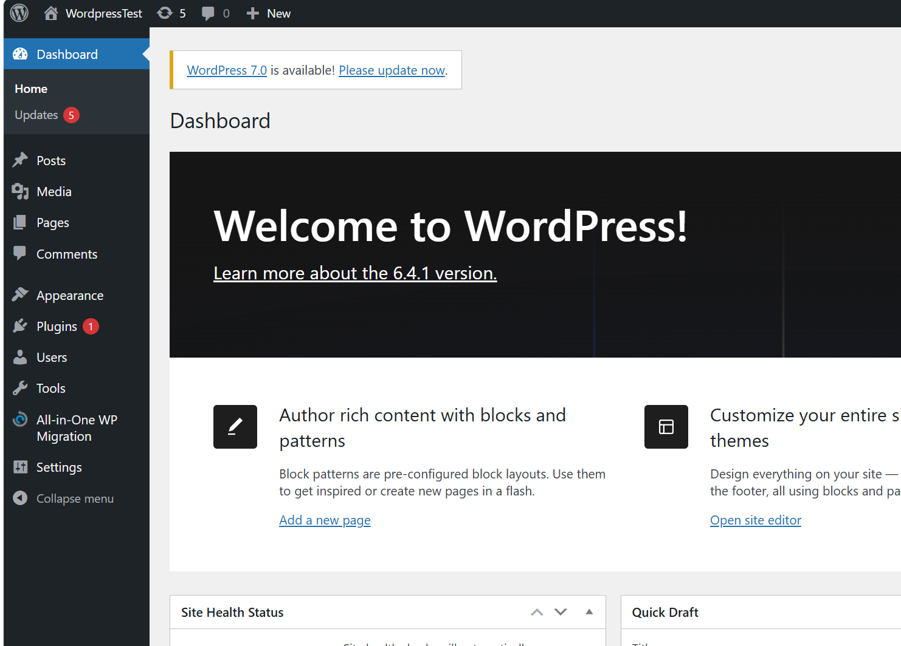
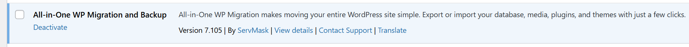
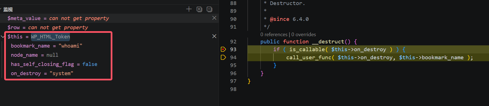
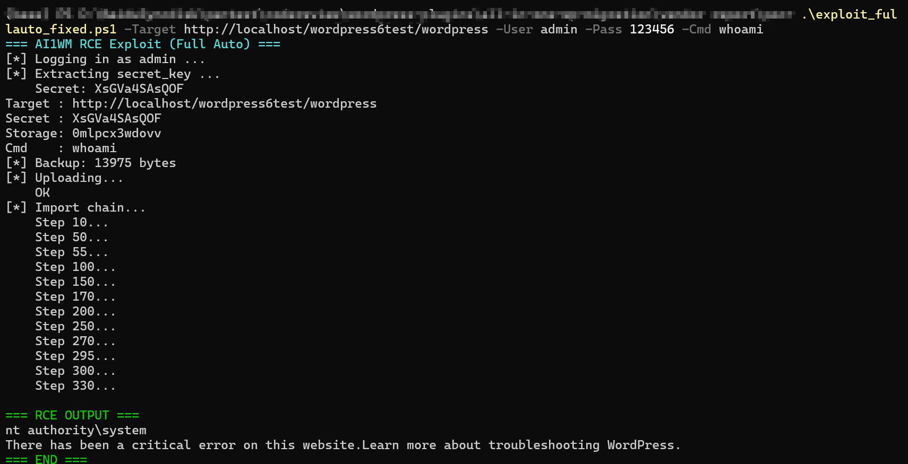

# All-in-One WP Migration v7.105 — PHP Object Injection via Insecure Deserialization

## Vulnerability Type

PHP Object Injection via insecure deserialization

## Component

`lib/model/import/class-ai1wm-import-options.php:56`

## Attack Chain (Entry Point to Execution)

The vulnerability is triggered through the backup import pipeline. The demo exploited the `WP_HTML_Token::__destruct` gadget chain in WordPress versions 6.4.0 ~ 6.4.1. Below is the full call chain with file, line number, code, and significance:

### Step 1: Upload malicious backup

**File**: `lib/model/import/class-ai1wm-import-upload.php:37-38, 104`
Entry point. Attacker uploads a crafted `.wpress` backup file via `wp_ajax_nopriv_ai1wm_import`. The file is copied to storage directory.

```php
// Line 37-38: Receive uploaded file
if ( isset( $_FILES['upload_file']['tmp_name'] ) ) {
    $upload_tmp_name = $_FILES['upload_file']['tmp_name'];
// ...
// Line 104: Copy uploaded file to storage
ai1wm_copy( $upload_tmp_name, ai1wm_archive_path( $params ) );
```

### Step 2: Database SQL import

**File**: `lib/vendor/servmask/database/class-ai1wm-database.php:1083-1156`
Extracts `database.sql` from the backup and executes each SQL statement. No SQL content filtering. Attacker-controlled SQL including `CREATE TABLE wp_sitemeta` + `INSERT` with malicious serialized payload is executed here.

```php
// Line 1083: Import method
public function import( $file_name, &$query_offset = 0 ) {
// ...
// Line 1109: Read SQL line by line
while ( ( $line = fgets( $file_handler ) ) !== false ) {
    $query .= $line;
    if ( preg_match( '/;\s*$/S', $query ) ) {
        $query = trim( $query );
        if ( strlen( $query ) <= $max_allowed_packet ) {
            $query = $this->replace_table_prefixes( $query );
            if ( $this->should_ignore_query( $query ) === false ) {
                $this->query( $query ); // Line 1156: Execute attacker's SQL
            }
        }
    }
}
```

### Step 3: Query sitemeta table
**File**: `lib/model/import/class-ai1wm-import-options.php:50-53`
Checks if sitemeta table exists (created by attacker in step 2), then queries the attacker-controlled `meta_value` column.

```php
// Line 50: Check sitemeta table exists
if ( in_array( "{$mainsite_prefix}sitemeta", $tables ) ) {
    // Line 53: Query the attacker-controlled value
    $result = $db_client->query( "SELECT meta_value FROM `{$mainsite_prefix}sitemeta` WHERE meta_key = 'fs_accounts'" );
```

### Step 4: Unserialize (VULNERABILITY)

**File**: `lib/model/import/class-ai1wm-import-options.php:56`
**THE VULNERABILITY**. Passes attacker-controlled serialized data to `maybe_unserialize()` with no `allowed_classes` restriction. `WP_HTML_Token` object is instantiated here from the serialized payload.

```php
$meta_value = maybe_unserialize( $row['meta_value'] );
```

### Step 5: Array merge triggers scope exit

**File**: `lib/model/import/class-ai1wm-import-options.php:59`
On PHP 8.0/8.1: silently casts object to array. On PHP 8.2+: throws TypeError, triggering scope exit and object destruction.

```php
if ( ( $fs_accounts = array_merge( $fs_accounts, $meta_value ) ) ) {
```

### Step 6: Gadget chain — __destruct()

**File**: `wp-includes/html-api/class-wp-html-token.php:92-94` (WordPress core 6.4.1)
**Meaning**: **GADGET**. When the `WP_HTML_Token` object goes out of scope (normal function end or error shutdown), `__destruct()` fires automatically, calling `call_user_func()` with attacker-controlled parameters.

```php
// Line 92: Destructor
public function __destruct() {
    if ( is_callable( $this->on_destroy ) ) {
        call_user_func( $this->on_destroy, $this->bookmark_name ); // Line 94
    }
}
```

### Step 7: RCE
**Result**: `call_user_func('system', 'cmd /c whoami')` executes arbitrary OS commands as the web server user.

```
whoami = nt authority\system
```


## Description

During the backup import process (step 330, `Ai1wm_Import_Options::execute()`), the plugin reads the `fs_accounts` option from the `sitemeta` table and passes the value directly to PHP's `maybe_unserialize()` without any restrictions on allowed classes:

```php
// class-ai1wm-import-options.php:53-56
$result = $db_client->query(
    "SELECT meta_value FROM `{$mainsite_prefix}sitemeta` WHERE meta_key = 'fs_accounts'"
);
if ( ( $row = $db_client->fetch_assoc( $result ) ) ) {
    $meta_value = maybe_unserialize( $row['meta_value'] );
    // ...
}
```

The `$row['meta_value']` originates from the backup's `database.sql` file, which is fully attacker-controlled. Since `maybe_unserialize()` does not use the `allowed_classes` parameter, any PHP object type can be instantiated.


## Exploit Flow Summary

```
Attacker-Controlled Data Flow:
  .wpress backup → database.sql → SQL INSERT → wp_mainsite_sitemeta.meta_value
                                                              ↓
                                                     maybe_unserialize()
                                                              ↓
                                                    WP_HTML_Token Object
                                                              ↓
                                                    PHP 8.2+: array_merge() TypeError
                                                              ↓
                                                    __destruct() → call_user_func('system', 'whoami')
                                                              ↓
                                                         RCE
```


## Available Gadget Chains

| Gadget                                                       | WordPress Version | Method                                                    |
| :----------------------------------------------------------- | :---------------- | :-------------------------------------------------------- |
| `WP_HTML_Token::__destruct`                                  | 6.4.0 ~ 6.4.1     | `call_user_func($this->on_destroy, $this->bookmark_name)` |
| Other plugins/themes<br />**It is known that a gadget exists in Yoast SEO.** | Any               | Any class with `__destruct` + dangerous call              |

**`WP_HTML_Token`** (wp-includes/html-api/class-wp-html-token.php:92-94): Known available gadget class

The gadget exploitation in the Yoast SEO plugin can be found at [https://soy-saber.github.io/2026/06/04/wordpress%E6%8F%92%E4%BB%B6%E6%BC%8F%E6%B4%9E%E5%88%86%E6%9E%90/](https://soy-saber.github.io/2026/06/04/wordpress插件漏洞分析/)

## ScreenShots

local environment:





debug:



successful exploitation:


